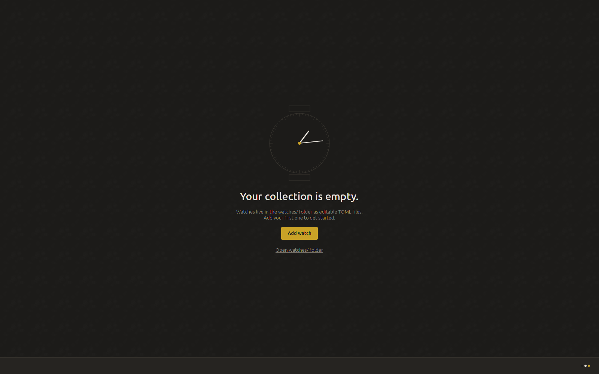

<p align="center" width="100%">
    
</p>

<h1 align="center">SAAT</h1>
<p align="center"><strong>Watch Collection / Saat Koleksiyonu</strong></p>

<p align="center">
  
  
  
</p>

<p align="center">
  
  
  
  
 
</p>


---

## 1. DESCRIPTION

SAAT catalogues your wristwatch collection on **your own machine** — a photo-forward grid,
a full spec sheet per watch, a calendar of what you wore, and side-by-side comparison.
Every watch is a plain text file in a folder you own: no database, no account, no network,
nothing that expires. It opens in **English** or **Türkçe**, and it runs on Windows, Linux
and Android.

**It ships empty on purpose.** Entering the collection is the hobby; the app is the frame,
not the contents.



---

## 2. DEPENDENCIES

**To simply use it — nothing to install by hand.** Every download below carries its own
Qt and Python, so it does not care what your system already has.

- **Windows 10 and 11** — none at all.
- **Linux** — glibc 2.35 or newer. That means Ubuntu 22.04+, Debian 12+, Fedora 36+,
  Mint 21+, and current Arch. Nothing else.
- **Android 8.0 or newer** — none, and it declares **no permissions at all** (see 3.F).

**To build it yourself:**

- **Python 3.11 or newer** and `git`. That is the whole list for the desktop app.
- For the Android app, a JDK 17+ and the Android SDK — see
  [`docs/BUILDING.md`](docs/BUILDING.md).

---

## 3. INSTALLATION

Desktop downloads are on the **[v2.1.1 release page][rel-desktop]**; the Android app is on
its **[own release page][rel-android]**, because the two are versioned separately.

> **Use those two links rather than "latest".** GitHub marks whichever release came out
> most recently as *Latest*, and right now that is the Android one — so a "latest" link
> would send you to a page with nothing but an APK on it.

[rel-desktop]: https://github.com/sudo-megas/SAAT/releases/tag/v2.1.1
[rel-android]: https://github.com/sudo-megas/SAAT/releases/tag/android-v1.1

### 3.A Build From Source

```sh
git clone https://github.com/sudo-megas/SAAT.git
cd SAAT
./run.sh
```

On Windows use `.\run.ps1` instead. **No arguments, and nothing to install first** —
the script makes its own `.venv/`, installs the three dependencies into it, and starts
the app. Running it this way keeps your collection in the project folder beside
`run.sh`.

Two things that trip people up, so they do not look like failures:

- **On Arch, do not `pip install` by hand.** The system Python refuses it (PEP 668,
  "externally managed environment"). `run.sh` sidesteps that entirely by using a venv —
  or `sudo pacman -S pyside6 python-pillow` if you would rather use system packages.
- **If PowerShell refuses to run `run.ps1`**, Windows is blocking unsigned local
  scripts. Either `powershell -ExecutionPolicy Bypass -File .\run.ps1` once, or
  `Set-ExecutionPolicy -Scope CurrentUser RemoteSigned` permanently.

[`docs/BUILDING.md`](docs/BUILDING.md) covers building the portable folder, the Windows
installer and the `.deb` if you want the packages too.

### 3.B Arch Linux

Download **`saat-2.1.1-1-x86_64.pkg.tar.zst`** from the release page and install it:

```sh
sudo pacman -U saat-2.1.1-1-x86_64.pkg.tar.zst
```

SAAT then appears in your application menu. Like the `.deb` below, it bundles its own Qt
and Python rather than linking against Arch's own `pyside6` — see [3.C](#3c-every-other-linux-distribution)
if you would rather not install anything at all.

To remove it:

```sh
sudo pacman -Rns saat
```

**Removing it never touches your collection.** `~/.local/share/saat` and `~/.config/saat`
are left exactly as they are — asserted automatically on every release build, not merely
intended.

**There is no AUR package.** This `.pkg.tar.zst` is a binary built once and attached to the
GitHub release, not something `pacman -Syu` or an AUR helper will ever find on its own —
getting the next version means downloading it by hand again, the same as every other
platform's download on this page.

### 3.C Every other Linux distribution

Download **`SAAT-v2.1.1-linux-x86_64.tar.gz`**, extract it, run it:

```sh
tar -xzf SAAT-v2.1.1-linux-x86_64.tar.gz
./SAAT/SAAT
```

That folder is self-contained and **fully portable** — copy it to a USB stick and your
collection travels inside it, because in this mode SAAT keeps everything *beside the
executable* rather than in your home folder. This is also the way to run SAAT on Arch
without installing a package at all.

For a normal system-wide install with a menu entry, there is an
[`install.sh`](install.sh) in the repository.

### 3.D Debian, Ubuntu, Mint and derivatives

Download **`saat_2.1.1-1_amd64.deb`** and install it:

```sh
sudo apt install ./saat_2.1.1-1_amd64.deb
```

SAAT then appears in your application menu. There is nothing else to set up. It is about
230 MB installed, almost all of it Qt.

To remove it:

```sh
sudo apt remove saat        # or: sudo apt purge saat
```

**Neither touches your collection.** `~/.local/share/saat` and `~/.config/saat` are left
exactly as they are, purge included — asserted automatically on every release build, not
merely intended.

### 3.E Windows 10 and 11

1. Download **`SAAT-v2.1.1-windows-x64-setup.exe`** and run it.
2. **Windows will show "Windows protected your PC".** This is expected. Click
   **More info → Run anyway**. That warning means "this publisher has not paid for a
   certificate", not "this file is known to be harmful" — a signing certificate is a few
   hundred dollars a year and this is a free hobby project.
3. **No administrator password is needed.** It installs for your user only, into
   `%LOCALAPPDATA%\Programs\SAAT`, and adds a Start Menu entry.
4. **Uninstalling never deletes your collection.** It lives in `%LOCALAPPDATA%\SAAT`,
   beside the program folder rather than inside it, so the uninstaller cannot reach it.

There is also a portable **`.zip`** if you would rather not install anything — extract it
and run `SAAT.exe`. In that mode your collection lives inside the extracted folder.

### 3.F Android 8.0 and newer

Download **`saat-android-1.1.apk`** from the [Android release page][rel-android].

1. Tap the downloaded APK. Android says your browser or file manager is not allowed to
   install apps.
2. Tap **Settings**, turn on **Allow from this source**, and come back.

Same category of warning as the Windows one — it means "this did not come through a
store", not "this is known to be harmful".

**It declares no permissions at all.** Not "only the ones it needs" — *none*. No internet,
no camera, no storage. Photographs come in through the system photo picker, the camera
through an intent the system fulfils, and the ZIP through the Storage Access Framework;
in each case the system does the work and hands back the result, which needs no
permission. **You can check this yourself instead of trusting it:** long-press the
installed app → App info → Permissions.

**Uninstalling the app deletes your collection**, unlike on desktop — Android gives an app
no place to leave anything behind. Export first if you mean to keep it.

<!-- Screenshots: to be taken by the owner, from the real collection, per hard rule
     1 — the grid, the detail page, the calendar and the compare screen, in dark
     mode, at the phone's native resolution. Never generated, never fabricated. -->

---

## 4. HOW TO USE? WHAT IS THE APPLICATION SECTIONS?

### Before anything else — the first run

SAAT opens **empty**, and that is not a bug. Press **Add** and fill in a watch; the only
field it truly insists on is a brand and a model. Everything else — movement, case, dial,
straps, what you paid — can be filled in later or never.

Your collection is **yours on your disk**, in plain text, and SAAT never uploads, syncs or
phones home. It opens no network socket at all.

### The sections

| Section | What it is for |
|---|---|
| **Grid** | The home view. Cards led by each watch's own photograph, reflowing to your window width. Sort and search from the bar above; click any card to open it. |
| **Specs** — the table | The same collection as a dense, sortable table, with column presets that follow the data model: identity, movement, case, dial, straps, acquisition. This is the view for studying rather than admiring. |
| **Calendar** | Record what you wore, by month, week or year. The year view colours each day by watch, which is how you find out what you actually reach for rather than what you think you do. Stats mode ranks rotation, coverage and streaks over any period. |
| **Detail page** | One watch in full: the photograph at proper size, every specification, service and timing history, a strip of recent wear, and which of your other straps physically fit it. |
| **Compare** | Two to four watches side by side, with a to-scale drawing of their cases, their accuracy ranges on one axis, and bars for the numbers that actually differ. |
| **Wishlist** | A second collection for watches you do not own yet, with target prices — and one click to move one across when you finally buy it. |
| **Settings** | Ten colour palettes, English or Türkçe, a system tray icon, and PDF export of whatever you are looking at. |

### On the phone, additionally

| | |
|---|---|
| **Home-screen widget** | Shows today's watch, and taps through to record one. |
| **Launcher shortcut** | "Wore this today" — long-press the app icon and log a watch in two taps, without opening the app at all. |
| **Pick for me** | Can't decide? Let the calendar suggest a watch — random, or weighted toward whatever you haven't worn in a while. Re-roll until you like the answer; nothing is recorded until you confirm it. |
| **ZIP bridge** | **Settings → Export** writes a ZIP holding exactly the `watches/` folder in the layout the desktop app uses — so unzipping it into your desktop collection *is* the import on that side. It works both ways, and watches you already have are skipped rather than overwritten, so re-importing is never destructive. |

### Where your collection lives

|  | Portable (tarball or `.zip`) | Installed |
|---|---|---|
| watches, backups — Linux | beside the executable | `~/.local/share/saat/` |
| configuration — Linux | beside the executable | `~/.config/saat/` |
| watches, backups — Windows | beside the executable | `%LOCALAPPDATA%\SAAT\` |
| configuration — Windows | beside the executable | `%APPDATA%\SAAT\` |

Each watch is its own folder holding a `watch.toml` and an `images/` subfolder.
`watch.toml` is plain text you can open in any editor — and comments you write into it
survive the app saving over the file.

**Nothing is ever destroyed quietly.** Before any destructive change the previous version
is copied into `backups/` (newest 20 kept), and deleting a watch moves its whole folder to
`backups/deleted/` rather than erasing it.

More detail — the `.installed` marker, the `SAAT_DATA_DIR` override, and the full field
reference — is in [`docs/BUILDING.md`](docs/BUILDING.md) and
[`watches/_template.toml`](watches/_template.toml).

---

## 5. LICENCE SUMMARY

SAAT is free software under the **GNU General Public License, version 3 or later**
(`GPL-3.0-or-later`).

In plain terms: you may use it for anything, study how it works, share it with anyone, and
change it to suit yourself. If you distribute a changed version, it must carry this same
licence, so that whoever receives it has the freedoms you had. It comes with **no
warranty**.

That is a summary and nothing more — the text that actually governs is the full
[`LICENSE`](LICENSE) file in this repository.

SAAT also redistributes other people's work: Qt through PySide6 under the LGPL-3.0, the
Ubuntu font family, and a layout adapted from Qt's own examples. Every one of them is
credited, with its licence, in
[`docs/THIRD-PARTY-LICENCES.md`](docs/THIRD-PARTY-LICENCES.md).

Copyright © sudo-megas · <https://github.com/sudo-megas/SAAT>

*Built with Reason and Passion.*
